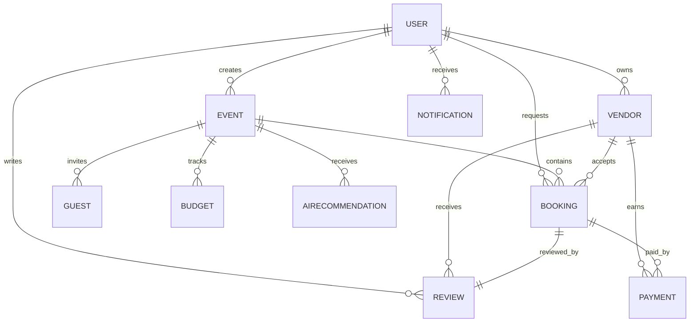

# Database Schema

## Collections

- `users`: customer/vendor/admin identity, encrypted password, verification state, refresh hash and reset OTP.
- `vendors`: business profile, category, city, images, packages, availability, approval state and ratings.
- `events`: customer event, event type, date/time, venue, budget, timeline and status.
- `budgets`: event expense line items with planned and actual spend.
- `bookings`: event/customer/vendor booking request, amount, package, date and status.
- `payments`: Stripe payment intent, invoice URL, status and refund totals.
- `guests`: event guest details, RSVP, QR token and check-in state.
- `notifications`: in-app/email/SMS notification records.
- `reviews`: customer rating and review for a completed vendor booking.
- `airecommendations`: prompt, recommendation type, event link and generated response.

## ER Diagram

## Key Indexes

- `users.email` unique.
- `vendors.category`, `vendors.city`, `vendors.verified`, text index on business name/description/city.
- `events.customer`, `events.date`.
- `bookings.customer`, `bookings.vendor`, `bookings.status`.
- `guests.qrToken` unique.
- `reviews.vendor + customer + booking` unique.
